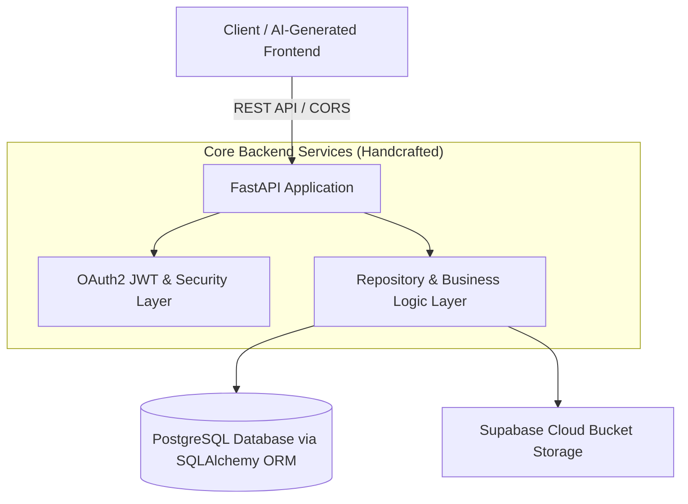

# 🚀 Luminova — High-Performance Full-Stack Blogging Platform

<div align="center">

[](https://fastapi.tiangolo.com/)
[](https://www.python.org/)
[](https://www.postgresql.org/)
[](https://www.sqlalchemy.org/)
[](https://jwt.io/)
[](https://vercel.com/)

<p align="center">
  <b>A modern, scalable blogging web application powered by a custom-engineered FastAPI backend and an AI-crafted responsive frontend.</b>
</p>

</div>

---

## 💡 Project Architecture & Highlight

> [!IMPORTANT]
> ### ⚡ Development Breakdown:
> * ⚙️ **Backend (Handcrafted & Custom Engineered):** Developed 100% from scratch with high performance, strict typing, granular OAuth2 JWT security, optimized SQLAlchemy 2.0 ORM queries, Supabase cloud asset storage, and clean Repository Architecture.
> * 🎨 **Frontend (AI-Generated SPA):** Modern, responsive, and glassmorphic user interface built with HTML5, CSS3, and Vanilla JavaScript using generative AI.



---

## 🛠️ Backend Tech Stack

| Component | Technology | Description |
| :--- | :--- | :--- |
| **Framework** | **FastAPI `0.136.3`** | Modern, high-performance async web framework for building APIs with Python |
| **ASGI Server** | **Uvicorn `0.49.0`** | Lightning-fast ASGI server implementation |
| **Database ORM** | **SQLAlchemy `2.0.51`** | Object Relational Mapper for database abstraction and query optimization |
| **Database Driver** | **psycopg2-binary `2.9.12`** | PostgreSQL database adapter for Python |
| **Data Validation** | **Pydantic `2.13.4`** | Robust data validation and settings management using Python type annotations |
| **Security & Auth** | **python-jose `3.5.0` & PyJWT** | JSON Web Token (JWT) creation, signing, and decoding |
| **Password Hashing** | **Passlib `1.7.4` + Bcrypt `4.0.1`** | Secure one-way salt-and-hash encryption |
| **Cloud Storage** | **Supabase Storage `2.31.0`** | Cloud file storage SDK for blog image uploads & asset deletion |
| **Environment Mgmt** | **pydantic-settings `2.14.2`** | Type-safe `.env` loading and application configuration |
| **Deployment** | **Vercel Serverless Python** | Unified serverless API routing & static asset distribution |

---

## 🔒 Security, Middleware & Authentication

```
  ┌─────────────────┐
  │ Incoming Request │
  └────────┬────────┘
           │
           ▼
  ┌────────────────────────────────────────────────────────┐
  │  CORS Middleware                                       │
  │  • allow_origins: ["*"]                                │
  │  • allow_credentials: True                             │
  │  • allow_methods: ["*"]                                │
  │  • allow_headers: ["*"]                                │
  └────────┬───────────────────────────────────────────────┘
           │
           ├───► [Strict Auth: get_current_user] ──────────► Protected Routes (Create, Edit, Delete)
           │     • Validates JWT Bearer Token
           │     • Enforces User / Author Ownership
           │
           └───► [Optional Auth: get_current_user_optional] ─► Public / Dynamic Routes (Feed, Read)
                 • Resolves Guest access without error
                 • Injects personalized state (e.g., is_starred)
```

### 1. CORS (Cross-Origin Resource Sharing)
* Configured using `fastapi.middleware.cors.CORSMiddleware`.
* Supports cross-origin queries, headers, credentials, and all standard HTTP methods.

### 2. Authentication Flow
* **Bcrypt Password Encryption:** Passwords are never saved in plain text; hashed with Passlib before persistence.
* **JWT Access Tokens:** Token generation with custom expiration parameters (`access_token_expiration_minute`), signed with symmetric secret keys (`HS256`).
* **Dual Dependency Resolution:**
  * `get_current_user`: Ensures strict authentication for protected operations.
  * `get_current_user_optional`: Allows public viewing for guest users while dynamically returning personalized states (e.g. whether the current user has starred the post) if a token is present.
* **Ownership Verification:** Enforces strict authorization policies (`blog.author_id == current_user.id`) for update, delete, and media mutation endpoints.

---

## 🗄️ Database Architecture & Schema

Built on **PostgreSQL** with cascading relationships and optimized foreign key constraints:

```
 ┌──────────────────────┐             ┌──────────────────────┐
 │        Users         │ 1         * │        Blogs         │
 ├──────────────────────┤────────────►├──────────────────────┤
 │ id (PK)              │             │ id (PK)              │
 │ username (Unique)    │             │ title                │
 │ email (Unique)       │             │ content (Text)       │
 │ password (Hashed)    │             │ thumbnail            │
 │ bio                  │             │ author_id (FK Users) │
 │ profile_image        │             │ visibility (Boolean) │
 │ created_at           │             │ created_at           │
 └──────────┬───────────┘             └───────────┬──────────┘
            │                                     │
            │ 1                                   │ 1
            │                                     │
            ▼ *                                   ▼ *
 ┌──────────────────────┐             ┌──────────────────────┐
 │        Stars         │             │      BlogImages      │
 ├──────────────────────┤             ├──────────────────────┤
 │ user_id (PK, FK)     │             │ id (PK)              │
 │ blog_id (PK, FK)     │             │ blog_id (FK Blogs)   │
 │ created_at           │             │ image_url            │
 └──────────────────────┘             │ display_order        │
                                      └──────────────────────┘
```

> **Query Optimization:** Implemented `joinedload()` to eliminate $N+1$ query issues and combined `func.count(distinct(...))` aggregations to deliver blog listings, author profiles, image carousels, and star counts in single round-trips.

---

## ✨ Key Backend Features

- [x] **RESTful Modular Architecture:** Clean separation between API routes (`/routes`), business logic (`/repository`), models (`/models`), and Pydantic schemas (`/schemas`).
- [x] **Supabase Storage Integration:** Direct multi-file cloud upload pipeline with public URL generation and automatic cleanup of remote assets when posts/images are deleted.
- [x] **Advanced Querying & Pagination:** Built-in case-insensitive full-text search (`ilike`), sorting (`newest`, `oldest`), and offset-limit pagination with metadata (`page`, `limit`, `total`, `pages`, `has_next`).
- [x] **Social Features & Interactions:** Star/Unstar blogs with idempotent checks, aggregate star counters, and personalized user star feeds.
- [x] **User Profiles & Lifecycle:** Profile customizer (bio, avatar, username), "My Blogs" dashboard, and user account deletion with full cascade.
- [x] **Auto-Generated Interactive Docs:** Interactive API testing out-of-the-box via Swagger UI (`/docs` or `/api/docs`) and ReDoc (`/redoc` or `/api/redoc`).

---

## 📡 API Endpoint Reference

<details open>
<summary><b>🔐 Authentication & User Endpoints</b></summary>

| Method | Endpoint | Auth Required | Description |
| :--- | :--- | :---: | :--- |
| `POST` | `/signup` | ❌ | Register new account |
| `POST` | `/login` | ❌ | Authenticate credentials and receive Bearer JWT |
| `GET` | `/users/{id}` | ✅ | Fetch public profile details |
| `PATCH` | `/users/me` | ✅ | Update current user's profile and avatar |
| `DELETE` | `/users/me` | ✅ | Delete current user account and cascade data |
| `GET` | `/users/me/blogs` | ✅ | List all blogs authored by the current user |
| `GET` | `/users/me/starred`| ✅ | List all blogs starred by the current user |

</details>

<details open>
<summary><b>📝 Blog & Interaction Endpoints</b></summary>

| Method | Endpoint | Auth Required | Description |
| :--- | :--- | :---: | :--- |
| `GET` | `/blogs` | 🟡 Optional | Retrieve paginated public blogs with search & sort |
| `GET` | `/blogs/{id}` | 🟡 Optional | Fetch single blog with author and image details |
| `POST` | `/blogs` | ✅ | Create new blog post with optional embedded images |
| `PATCH` | `/blogs/{id}` | ✅ | Update title, content, or visibility (Owner only) |
| `DELETE`| `/blogs/{id}` | ✅ | Delete post and remove cloud images (Owner only) |
| `POST` | `/blogs/{id}/images/upload` | ✅ | Upload multiple images directly to Supabase |
| `POST` | `/blogs/{id}/star` | ✅ | Star a blog post |
| `DELETE`| `/blogs/{id}/star` | ✅ | Remove star from a blog post |
| `DELETE`| `/images/{id}` | ✅ | Delete specific blog image (Owner only) |

</details>

---

## 📦 Project Directory Structure

```text
├── api/                    # Vercel serverless entry point
│   └── index.py            # API routing & docs configuration
├── routes/                 # FastAPI router declarations
│   ├── auth.py             # Login & Registration routes
│   ├── blogs.py            # Blog CRUD & Image upload routes
│   ├── images.py           # Image management routes
│   ├── stars.py            # Star / Like interaction routes
│   └── users.py            # User profile routes
├── repository/             # Data access layer & business logic
│   ├── blog.py             # Blog operations & Supabase storage sync
│   ├── image.py            # Image DB & cloud deletion logic
│   ├── star.py             # Star management logic
│   └── user.py             # User profile operations
├── public/                 # AI-Generated Frontend SPA
│   ├── index.html          # Semantic HTML5 UI layout
│   ├── styles.css          # Glassmorphic CSS styling
│   └── app.js              # Client-side API integration & state
├── config.py               # Pydantic Settings & environment loader
├── database.py             # SQLAlchemy Engine & SessionLocal setup
├── models.py               # SQLAlchemy ORM database models
├── schemas.py              # Pydantic request / response schemas
├── Oauth2.py               # JWT token utilities & auth dependencies
├── supabase_client.py      # Supabase cloud storage client initialization
├── utils.py                # Password hashing & verification utilities
├── vercel.json             # Serverless deployment configuration
├── requirements.txt        # Python dependency manifest
└── README.md               # Project documentation
```

---

## 🚀 Getting Started

### 1. Clone the Repository
```bash
git clone https://github.com/Aruu4u/BlogWeb.git
cd BlogWeb
```

### 2. Configure Virtual Environment & Dependencies
```bash
# Create virtual environment
python -m venv venv

# Activate virtual environment
# Windows:
venv\Scripts\activate
# Linux / macOS:
source venv/bin/activate

# Install dependencies
pip install -r requirements.txt
```

### 3. Set Up Environment Variables
Create a `.env` file in the root directory:
```env
DB_HOSTNAME=your_postgres_host
DB_PORT=5432
DB_PASSWORD=your_db_password
DB_NAME=your_db_name
DB_USERNAME=your_db_user
SECRET_KEY=your_super_secret_jwt_key
ALGORITHM=HS256
ACCESS_TOKEN_EXPIRATION_MINUTE=60
SUPABASE_URL=https://your-project.supabase.co
SUPABASE_KEY=your_supabase_anon_or_service_key
SUPABASE_BUCKET=Blog_images
```

### 4. Run the Development Server
```bash
uvicorn main:app --reload
```
The server will start at `http://127.0.0.1:8000`.

- **Interactive API Docs:** `http://127.0.0.1:8000/docs`
- **Alternative API Docs:** `http://127.0.0.1:8000/redoc`

---

## 📄 License
This project is open source and available under the [MIT License](LICENSE).
